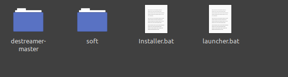
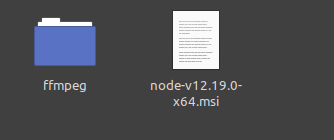

# Destreamer Windows Installer Script

This is an auto-installer script that prepares a windows machine to be able to use destreamer project.

> Note: Collegues' profile links will be updated once their profiles are ready.

## Idea

On campus, we use Microsoft Stream for uploading lectures, but we don't have the option to download them (we don't have the owner permission to download them), so I conducted some research with the help of my collegues [Fares Basousy](#) & [Hassan Ali](https://github.com/HassanAli66) and we found [Destreamer](https://github.com/snobu/destreamer) project where we can download any video through capturing the stream data and convert it using ffmpeg to be saved on our device. This method can work as long as any account has access to the video one wants to download. We spent alot of time preparing each of our windows machines as we needed to:
* Clone the repo.
* Install Node.js.
* Install ffmpeg.
* Add ffmpeg to the machine environment variables.
* Use npm to install Destreamer.
* Create a non-adminstrative user.
* Give the repo folder the required permissions to read and write.
* Launch the executable from the non-adminstrative user.

So we thought, why don't we make it automatic?

## Challenges

* DOS Batch Script was chosen as it easily interacts with various system features such as: `REG` , `setx` , `npm` (after installation) , `net user` , & `icacls` .
* Understand how to run each system feature and add the suitable arguments.
* Understand the different CWD scopes between running executables as a normal user and as an adminstrative user.

## Preparation

We built the script for a limited time use. We weren't preparing it for a global use. However, it can be tweaked for installing newer versions of the software packages, it just needs some editing on hardcoded values.

The setup uses this tree to begin the installation:

> Install folder  
> |               
> |____ Installer.bat  
> |               
> |____ Launcher.bat   
> |               
> |____ soft      
> |`     `|         
> |`     `|____ ffmpeg `contains ffmpeg files`  
> |`     `|         
> |`     `|____ node-v*.msi                     
> |               
> |_____ destreamer-master `contains cloned destreamer repo`  

So you need to:
* Clone destreamer repository and extract it in the same directory of the .bat files. (Project can be cloned from [here](https://github.com/snobu/destreamer).)
* Download ffmpeg and place the extracted folder in the `soft` folder. (Download the win64 zip file from [here](https://github.com/BtbN/FFmpeg-Builds/releases).)
* Download Node.js setup and place it in the `soft` folder. (Installer can be downloaded from [here](https://nodejs.org/en/download/).)

So you will have the root directory similar to this:  
  
and the soft folder similar to this:  

Now to the last thing. We need to edit the scipt hardcoded values. Open `Installer.bat` in any text editor.
* At line 17, change the name of the Node.js setup file to the one you have in the `soft` folder.

That's all! Not much of an edit, is it? xd.

Before launching the script: 
* Make sure you disable any antivirus because as the script creates a new user and edits the machine environment variables, Antivirus software catches it as a potentiol virus.
* Run the program as an adminstrator for the commands to take effect!! (Right Click => Run as adminstrator)

